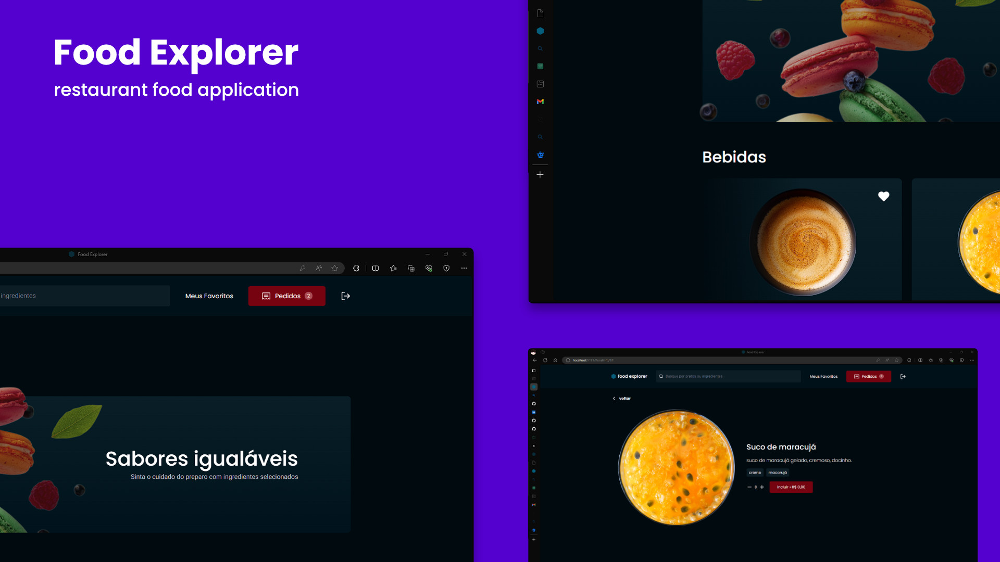

# Food Explorer 

food explore é um projeto realizado através do curso da RocketSeat que simula um restaurante.

Nele o cliente pode interagir vendo os produtos adicionados pelo administrador, adicionar em uma carinho e finalizar a compra.

o administrador pode adicionados os pratos, bem como todos os detalhes do produto como as imagens, descrição, preço, categoria e tags de ingredientes.


## Stack utilizada

**Front-end:** 
React, 
Styles Components, 
knex,
Swiper,
React Icons,
React Router Dom,
react-toastify


**Back-end:** Node, Axios, pm2, JWT, bcryptjs, Jest, Multer, Express


### Iniciando a aplicação:

- in terminal clone this project:

```bash
$ git clone https://github.com/Wendell47/Food-Explorer-API.git
```

- access the project folder:

```bash
$ cd foodexplorer
```

- install dependencies:

```bash
$ npm install
```

- run server:

```bash
$ npm run dev

# If all goes well, this message will appear in the terminal:
Server is running on port 3333
```

- run migrations:

```bash
$ npm run migrate
```
### Admin account access:

mail: admin@gmail.com</br>
password: 1234

### User account access:

mail: user@gmail.com</br>
password: 1234

## 🎨 Front-end

You can access the repository through [this link](https://github.com/Wendell47/FoodExplorer.git)


<p align="center">Developed with ❤️ by <a href="https://github.com/Wendell47/" target="_blank">Wendel Araujo</a></p>